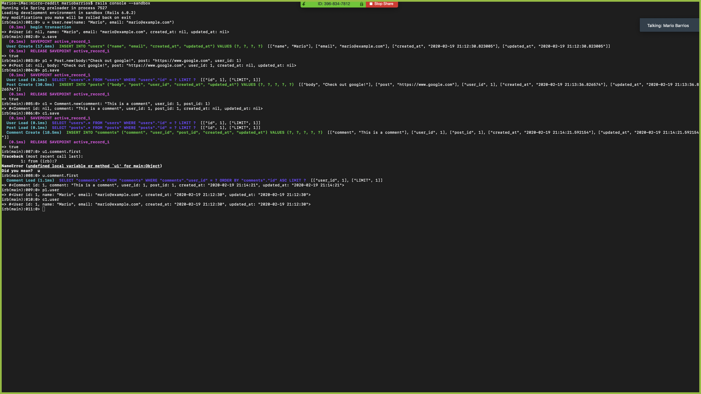

# Building with Active Record

> 

Additional description about the p

## Built With

- Ruby,
- Ruby on Rails 6

## Getting Started

**This is an example of how you may give instructions on setting up your project locally.**
**Modify this file to match your project, remove sections that don't apply. For example: delete the testing section if the currect project doesn't require testing.**

To get a local copy up and running follow these simple example steps.

### Prerequisites

### Setup

### Install

### Usage

### Run tests

### Deployment

## Authors

👤 **Rohan Sundar**

- Github: [@rsundar](https://github.com/rsundar)
- Twitter: [@skelegrow](https://twitter.com/)
- Linkedin: [linkedin](https://linkedin.com/linkedinhandle)

👤 **Mario Barrios**

- Github: [@mariobarrioss](https://github.com/mariobarrioss)
- Twitter: [@twitterhandle](https://twitter.com/twitterhandle)
- Linkedin: [linkedin](https://linkedin.com/linkedinhandle)

## 🤝 Contributing

Contributions, issues and feature requests are welcome!

Feel free to check the [issues page](issues/).

## Show your support

Give a ⭐️ if you like this project!

## Acknowledgments

- Hat tip to anyone whose code was used
- Inspiration
- etc

## 📝 License

This project is [MIT](https://www.github.com/rsundar/micro-reddit/tree/master/LICENSE) licensed.